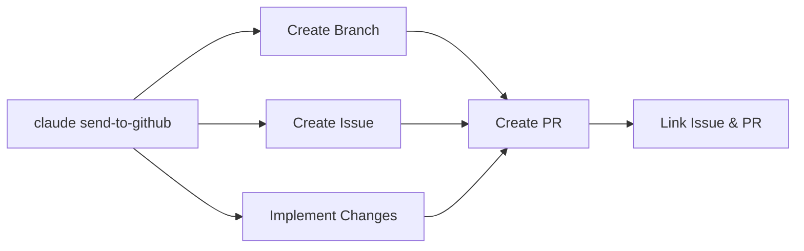

# Contributing to Fork Management Template

This guide explains how to contribute to the Fork Management Template repository. This covers enhancing the template itself, not using it to manage forks.

> For using this template to manage your own forks, see the documentation in the `doc/` directory.

## Quick Reference

**Contribution Focus**: Improve the template workflows, documentation, and patterns
**Branch Pattern**: `agent/<issue>-<description>` for contributions
**AI Context**: Review [CLAUDE.md](CLAUDE.md) and [AI_EVOLUTION.md](AI_EVOLUTION.md) before starting

## Template Enhancement Workflow

### Issue Creation

Create issues for template improvements:

```bash
gh issue create -t "Enhance sync workflow conflict detection" -l enhancement,template
```

### Development Process

1. **Context Loading**: Review ADRs, existing workflows, and template patterns
2. **Branch Creation**: `git checkout -b agent/<issue>-<description>`
3. **Implementation**: Follow existing patterns in `.github/workflows/` and documentation
4. **Validation**: Test workflows don't break existing template functionality
5. **Documentation**: Update relevant ADRs when making architectural changes

### Workflow Development

When modifying GitHub Actions workflows:

#### Validation Requirements
- YAML syntax validation using `yq`
- Test against multiple scenario repositories
- Ensure backward compatibility with existing instances
- Document any breaking changes clearly

#### Common Workflow Areas
- **Sync automation**: Improving upstream synchronization
- **Conflict detection**: Enhancing AI-assisted conflict analysis
- **Release management**: Refining automated versioning
- **Initialization**: Streamlining template setup process

### Documentation Contributions

#### ADR Updates
When making architectural changes, update or create ADRs in `doc/adr/`:
- Follow existing ADR format and numbering
- Document decision context, options considered, and consequences
- Link related workflows and implementation details

#### Workflow Documentation
Update relevant documentation in `doc/` for:
- New workflow capabilities
- Changed configuration requirements
- Updated synchronization strategies

## Working with AI Agents

This template is optimized for AI-agent collaboration:

### Context Loading for AI Agents
Before starting work, AI agents must review:
- [AI_EVOLUTION.md](AI_EVOLUTION.md) for historical patterns and lessons
- Current ADRs relevant to the planned changes
- Existing workflow patterns and conventions

### AI Agent Task Assignment
Label issues appropriately for AI assignment:

```bash
gh issue create -t "Improve workflow error handling" -l copilot,enhancement
gh issue create -t "Update template documentation" -l copilot,documentation
```

### Best AI Contribution Tasks
- Workflow enhancement and optimization
- Documentation updates and clarification
- Error handling improvements
- Template pattern refinement
- Testing and validation automation

### Avoid AI Assignment For
- Major architectural workflow changes
- Security-related configuration changes
- Breaking changes to template API

#### AI Developer Workflow (ADW)

Use Claude Code's `send-to-github` command for streamlined development workflow:

```bash
# Automated branching, issue creation, and PR submission
claude send-to-github "Enhance sync workflow with better conflict detection"
```

This command automates the complete AI Developer Workflow:
- **Branch Creation**: Automatically creates appropriately named feature branch
- **Issue Creation**: Creates GitHub issue with proper labels and description
- **Development**: Provides context for implementing the requested changes
- **PR Submission**: Creates pull request with detailed description and links to issue

**Benefits for Fork Management:**
- Maintains consistent branch naming (`agent/<issue>-<description>`)
- Automatically applies appropriate labels based on template context
- Links development work to trackable issues
- Streamlines the feedback loop between AI development and human review




## Quality Assurance

### Pre-Commit Checklist
- [ ] YAML workflows validate successfully
- [ ] No breaking changes to template API
- [ ] Documentation updated (ADRs for architectural changes)
- [ ] Template patterns remain consistent
- [ ] AI context preserved in CLAUDE.md/AI_EVOLUTION.md

### AI Session Logging
After completing work, update if necessary [AI_EVOLUTION.md](AI_EVOLUTION.md) with:
- New patterns discovered
- Conflict resolution strategies that worked
- Template improvements and their impact
- Lessons for future AI agents