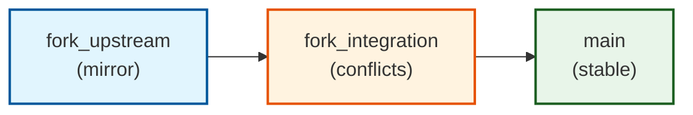

# Fork Management Template

#### AI-Driven Development

- 🤖 **Built with AI** - Developed and maintained using [Claude Code](CLAUDE.md) and [GitHub Copilot](.github/copilot-instructions.md)
- 📋 **AI Task Assignment** - Issues assigned to `copilot` or comments to `claude` invoke agents
- 📚 **AI-Friendly Documentation** - Comprehensive [guides](CONTRIBUTING.md) for AI agents
- 🔄 **Automated Workflows** - GitHub Actions with AI-enhanced PR descriptions and conflict resolution
- 🎯 **AI-First Architecture** - Designed with clear [principals](AI_PRINCIPLES.md) for AI understanding and modification

## What is Fork Management Template?

This template automates the complex task of maintaining long-lived forks of upstream repositories. It's designed for teams who need to:

| Preserve Local Changes | Smart Conflict Resolution | Release Versions | AI Development |
|:------------------------:|:---------------------------:|:------------------------:|:-----------------------:|
| Keep custom modifications safe while syncing upstream | AI-powered detection and resolution of merge conflicts | Align fork versions with upstream releases | Patterns and docs for AI agent integration |

**Perfect for**: scenarios requiring controlled upstream synchronization with forked changes.

## Core Architecture

The template implements a **three-branch strategy** that creates controlled integration checkpoints:

This flow ensures upstream changes are validated before reaching your stable branch, with AI-enhanced conflict analysis at each stage.

## Key Features

| Feature                | Description                                                                                   |
|------------------------|-----------------------------------------------------------------------------------------------|
| Automated Daily Sync   | Pulls upstream changes with conflict detection                                                |
| AI-Enhanced Analysis   | Intelligent PR descriptions and conflict categorization                                       |
| Branch Protection      | Prevents accidental damage to stable branches                                                 |
| Release Correlation    | Tracks your versions against upstream releases                                                |
| Multi-AI Ready         | Optimized for Claude Code and GitHub Copilot collaboration                                    |

## Prerequisites

Before starting, ensure you have:
- GitHub account with repository creation permissions
- (Optional) Personal Access Token (PAT) for full automation:
  - Create a secret named `GH_TOKEN` in your repository
  - Required scopes: `repo`, `workflow`, `admin:repo_hook`
  - Without PAT: Manual configuration of branch protection and secrets required

## Quick Start

### 1. Create New Repository
1. Click the "Use this template" button above
2. Choose a name and owner for your new repository
3. Create repository

### 2. Initialize Repository
1. Go to Actions → Select "Initialize Fork" → Click "Run workflow"
2. Follow the setup instructions in the auto-created issue
3. Configure your upstream repository and sync settings

## How It Works

1. **Daily Automation**: Checks upstream for changes and creates sync PRs
2. **Conflict Analysis**: AI categorizes conflicts and suggests resolution approaches  
3. **Staged Integration**: Changes flow through validation checkpoints
4. **Release Tracking**: Maintains correlation between your versions and upstream

**See detailed architecture diagrams and workflows**: [Product Architecture](doc/product-architecture.md)
