# Cascade Integration Workflow Specification

This document specifies the cascade integration workflow (`cascade.yml`) that automatically propagates upstream changes through the three-branch hierarchy from `fork_upstream` through `fork_integration` to `main`.

## Overview

The cascade workflow automates the progressive integration of upstream changes through the repository's branch hierarchy, ensuring proper validation and conflict resolution at each stage. It implements the integration strategy defined in [ADR-001](adr/001-three-branch-strategy.md) and works in conjunction with the sync workflow.

## Architecture Decision

**References**: 
- [ADR-001: Three-Branch Fork Management Strategy](adr/001-three-branch-strategy.md)
- [ADR-008: Centralized Label Management Strategy](adr/008-centralized-label-management.md)

**Key Benefits**:
- **Automated Propagation**: Changes flow automatically through branch hierarchy
- **Staged Validation**: Each integration stage runs full build and test validation
- **Conflict Isolation**: Conflicts are detected and isolated at appropriate levels
- **Integration Testing**: Dedicated stage for running integration tests before production

## Workflow Configuration

### Triggers
```yaml
on:
  push:
    branches:
      - fork_upstream      # When sync PR merges
      - fork_integration   # When integration PR merges
  pull_request:
    types: [closed]
    branches:
      - fork_upstream      # When PR to fork_upstream is closed
      - fork_integration   # When PR to fork_integration is closed
  workflow_dispatch:       # Allow manual trigger
```

**Note**: The `pull_request` trigger addresses GitHub token limitations where manual PR merges via the UI use `GITHUB_TOKEN` which cannot trigger other workflows. The cascade jobs include conditional logic to only process PRs labeled with `upstream-sync` that were actually merged.

### Permissions
```yaml
permissions:
  contents: write
  pull-requests: write
  issues: write
```

### Concurrency Control
```yaml
concurrency:
  group: cascade-${{ github.workflow }}-${{ github.ref }}
  cancel-in-progress: false  # Never cancel cascade operations
```

**Important**: Cascade operations must never run concurrently to prevent:
- Race conditions between integration stages
- Conflicting branch updates
- Duplicate PR creation
- Lost changes due to force pushes

## Workflow Process

### High-Level Flow

```mermaid
flowchart TD
    A[Push to fork_upstream] --> B{Check Active Cascades}
    B -->|Active| B1[Exit - Cascade in Progress]
    B -->|None| C[Cascade Job 1]
    C --> D[Update fork_integration with main]
    D --> E[Create PR: fork_upstream → fork_integration]
    E --> F{Conflicts?}
    F -->|Yes| G[Create Conflict PR]
    F -->|No| H[Create Clean PR]
    
    G --> I[Start SLA Timer]
    I --> J[Manual Resolution]
    H --> K[Auto Build & Test]
    
    J --> L{SLA Exceeded?}
    L -->|Yes| M[Escalate to Team]
    L -->|No| N[PR Merged to fork_integration]
    K --> N
    
    N --> O[Push to fork_integration]
    O --> P[Cascade Job 2]
    P --> Q[Create PR: fork_integration → main]
    Q --> R{Auto-merge Eligible?}
    R -->|Yes| S[Auto-merge to main]
    R -->|No| T[Manual Review]
    S --> U[Production Ready]
    T --> U
```


### Phase 1: Upstream to Integration Cascade

This phase triggers when changes are merged to `fork_upstream` via the sync workflow.

#### Step 0: Check Cascade State
```bash
# Check for active cascade operations
# Note: Assumes 'cascade-active' label exists (created during init)
active_cascades=$(gh pr list --label "cascade-active" --json number,title)
if [ "$(echo $active_cascades | jq length)" -gt 0 ]; then
  echo "::notice::Cascade already in progress, exiting"
  exit 0
fi
```

#### Step 1: Prepare Integration Branch
```bash
# Ensure fork_integration has latest from main
git checkout fork_integration
git merge origin/main --no-edit

# This ensures we test upstream changes against current features
```

**Rationale**: By updating `fork_integration` with `main` first, we ensure that upstream changes are tested against the latest feature development, not stale code.

#### Step 2: Create Integration PR
```yaml
# Create timestamped branch
INTEGRATION_BRANCH="integrate/upstream-$(date +%Y%m%d-%H%M%S)"
git checkout -b $INTEGRATION_BRANCH

# Attempt merge
git merge origin/fork_upstream --no-edit
```

#### Step 3: Conflict Detection
```yaml
# Detect conflicts
if git diff --check; then
  CONFLICTS_FOUND=false
else
  CONFLICTS_FOUND=true
  git diff --name-only --diff-filter=U > conflicted_files.txt
fi
```

#### Step 4: PR Creation

**Clean Merge PR**:
```yaml
gh pr create \
  --base fork_integration \
  --head $INTEGRATION_BRANCH \
  --title "✅ Integrate upstream changes - $(date +%Y-%m-%d)" \
  --body "$PR_BODY" \
  --label "upstream-sync,cascade-active"
```

**Conflict PR**:
```yaml
PR_URL=$(gh pr create \
  --base fork_integration \
  --head $INTEGRATION_BRANCH \
  --title "🚨 CONFLICTS: Integrate upstream changes - $(date +%Y-%m-%d)" \
  --body "$CONFLICT_PR_BODY" \
  --label "conflict,upstream-sync,needs-resolution,cascade-blocked")

# Record conflict creation time for SLA tracking
PR_NUMBER=$(basename $PR_URL)
gh pr comment $PR_NUMBER --body "Conflict detected at $(date -u +%Y-%m-%dT%H:%M:%SZ). SLA: 48 hours for resolution."
```

### Phase 2: Integration to Main Cascade

This phase triggers when changes are merged to `fork_integration`.

#### Step 1: Check for Changes
```bash
# Compare fork_integration with main
CHANGES=$(git rev-list --count origin/main..fork_integration)

if [ "$CHANGES" = "0" ]; then
  echo "No changes to cascade"
  exit 0
fi
```

#### Step 2: Create Production PR
```yaml
# Create release branch
MAIN_BRANCH="release/upstream-$(date +%Y%m%d-%H%M%S)"
git checkout -b $MAIN_BRANCH origin/fork_integration

# Create PR to main
gh pr create \
  --base main \
  --head $MAIN_BRANCH \
  --title "🚀 Cascade upstream changes to main - $(date +%Y-%m-%d)" \
  --body "$PR_BODY" \
  --label "upstream-sync,production-ready"
```

## Integration Testing

### Integration Branch Testing
When PRs target `fork_integration`, additional integration tests should run:

```yaml
# In build.yml, detect integration PRs
- name: Run Integration Tests
  if: github.base_ref == 'fork_integration'
  run: |
    # Run extended integration test suite
    mvn verify -Pintegration-tests
```

### Test Categories
1. **Unit Tests**: Run on all PRs (existing)
2. **Integration Tests**: Run on PRs to `fork_integration`
3. **Smoke Tests**: Run on PRs to `main`

## Error Handling and Recovery

### Merge Conflicts
```yaml
# When conflicts detected in Phase 1
- Create PR with conflict markers
- Add "conflict", "needs-resolution", and "cascade-blocked" labels
- Create linked issue for tracking
- Notify team via issue mentions
- Start 48-hour SLA timer
```

### Conflict Escalation
```yaml
# Run daily via scheduled workflow
- name: Check Stale Conflicts
  run: |
    # Find conflict PRs older than 48 hours
    stale_prs=$(gh pr list \
      --label "conflict,cascade-blocked" \
      --json number,createdAt,title \
      --jq '.[] | select((now - (.createdAt | fromdateiso8601)) > 172800)')
    
    for pr in $stale_prs; do
      pr_number=$(echo $pr | jq -r .number)
      
      # Create escalation issue
      gh issue create \
        --title "🚨 ESCALATION: Cascade conflict unresolved for 48+ hours" \
        --body "PR #$pr_number has unresolved conflicts blocking the cascade pipeline." \
        --label "escalation,high-priority,cascade-blocked" \
        --assignee "@$(gh api /repos/:owner/:repo/collaborators --jq '.[].login' | head -1)"
      
      # Update PR with escalation notice
      gh pr comment $pr_number --body "⚠️ This conflict has exceeded the 48-hour SLA and has been escalated."
    done
```

### Build Failures
```yaml
# If build fails on integration PR
- PR remains open
- Build status prevents merge
- 'cascade-failed' label added
- Team investigates failure
- May require upstream fix or local adaptation
```

### Recovery Procedures
1. **Conflict Resolution**:
   ```bash
   # Developer checks out branch
   git checkout integrate/upstream-TIMESTAMP
   # Resolve conflicts
   git merge --continue
   # Push resolution
   git push
   ```

2. **Build Failure Resolution**:
   - Fix in integration branch if local issue
   - Report upstream if upstream issue
   - Apply temporary patch if critical

## Automation Rules

### Auto-merge Eligibility

#### Phase 1: Upstream → Integration
**Always Manual Review** - This is the critical safety gate where upstream changes are first introduced.

#### Phase 2: Integration → Main
PRs can auto-merge if ALL conditions are met:
- No conflicts detected
- All status checks pass (build, test, security)
- No breaking changes identified
- Diff size < 1000 lines
- No changes to critical paths (defined in config)

```yaml
# Auto-merge logic for Integration → Main only
if [[ "$TARGET_BRANCH" == "main" ]] && 
   [[ "$CONFLICTS_FOUND" == "false" ]] && 
   [[ "$ALL_CHECKS_PASSED" == "true" ]] && 
   [[ "$DIFF_LINES" -lt 1000 ]] && 
   [[ "$BREAKING_CHANGES" == "false" ]]; then
  
  echo "✅ PR eligible for auto-merge"
  gh pr merge --auto --squash --delete-branch
  
  # Add auto-merge label for visibility
  gh pr edit --add-label "auto-merge-enabled"
else
  echo "❌ Manual review required"
  gh pr edit --add-label "manual-review-required"
fi
```

### Manual Intervention Points
1. **Conflict Resolution**: Always requires manual intervention
2. **Breaking Changes**: Detected via commit messages or file patterns
3. **Large Diffs**: Changes exceeding size thresholds
4. **Security Alerts**: Triggered by security scanning

## Performance Optimization

### Concurrent Operations
- Run build checks in parallel with PR creation
- Pre-fetch branches to reduce network calls
- Cache dependency resolution between stages

### Resource Management
```yaml
# Limit concurrent cascade operations
concurrency:
  group: cascade-${{ github.ref }}
  cancel-in-progress: false  # Never cancel cascade operations
```

## Cascade State Management

### State Labels
The cascade workflow uses predefined system labels to track state and enable visibility. All labels are created during repository initialization from `.github/labels.json` as defined in [ADR-008](adr/008-centralized-label-management.md).

See [Label Management Strategy](label-strategy.md) for the complete label reference.

#### Cascade-Specific Labels:
- `cascade-active` - Currently processing through pipeline
- `cascade-blocked` - Waiting on conflict resolution  
- `cascade-ready` - Passed all checks, ready for merge
- `cascade-failed` - Failed checks or build
- `cascade-escalated` - SLA exceeded, needs attention

#### Additional Labels Used:
- `upstream-sync` - Marks PRs containing upstream changes
- `conflict` - Indicates merge conflicts exist
- `needs-resolution` - Requires manual intervention
- `auto-merge-enabled` - PR will auto-merge when ready
- `manual-review-required` - Needs human review
- `escalation` - Escalated issues
- `high-priority` - High priority items
- `emergency` - Emergency issues
- `rollback` - Rollback operations
- `production-ready` - Ready for production

### Label Lifecycle
1. **cascade-active**: Added when PR created, removed when merged/closed
2. **cascade-blocked**: Added on conflict detection
3. **cascade-ready**: Added when all checks pass
4. **cascade-escalated**: Added after 48-hour SLA

## Visibility and Communication

### Status Dashboard
Create a GitHub Project board with automated rules:
- **In Progress**: PRs with `cascade-active`
- **Blocked**: PRs with `cascade-blocked`
- **Ready**: PRs with `cascade-ready`
- **Escalated**: Issues with `cascade-escalated`

### Notifications
```yaml
# Team notification on key events
- name: Notify Team
  if: steps.cascade.outputs.notification_required == 'true'
  run: |
    # Post to team slack/teams channel
    # Create GitHub notification
    # Update status dashboard
```

## Monitoring and Metrics

### Key Metrics
- **Cascade Success Rate**: Clean cascades vs. conflicts
- **Time to Production**: fork_upstream → main duration
- **Conflict Resolution Time**: Average time to resolve conflicts
- **Build Success Rate**: Per cascade stage
- **SLA Compliance**: % of conflicts resolved within 48 hours
- **Auto-merge Rate**: % of eligible PRs that auto-merged

### Alerting
```yaml
# Create alert issue on cascade failure
- name: Alert on Cascade Failure
  if: failure()
  run: |
    gh issue create \
      --title "🚨 Cascade Pipeline Failure" \
      --body "$FAILURE_DETAILS" \
      --label "cascade-failed,high-priority"
```

## Integration with Other Workflows

### Sync Workflow
- Triggers cascade when PR merges to `fork_upstream`
- Provides upstream changes to cascade

### Build Workflow
- Validates each cascade PR
- Runs appropriate test suites per stage

### Validate Workflow
- Ensures commit standards
- Checks PR compliance

### Release Workflow
- Triggered after successful cascade to main
- Includes upstream changes in release notes

## Configuration Options

### Environment Variables
```yaml
# Cascade behavior customization
CASCADE_AUTO_MERGE: true          # Enable auto-merge for clean cascades
CASCADE_CONFLICT_TIMEOUT: 48h     # Time before escalating conflicts
CASCADE_INTEGRATION_TESTS: true   # Run integration tests
CASCADE_BATCH_WINDOW: 1h         # Wait time for batching changes
```

### Workflow Customization
```yaml
# Disable specific cascade paths
SKIP_INTEGRATION_CASCADE: false   # Skip fork_integration stage
DIRECT_TO_MAIN: false            # Allow direct upstream→main (dangerous)
```

## Testing Strategy

### Unit Tests
- Cascade logic functions
- Conflict detection accuracy
- PR creation templates

### Integration Tests
- Full cascade simulation
- Multi-stage propagation
- Conflict scenario handling

### End-to-End Tests
- Complete sync→cascade→release flow
- Performance under load
- Recovery procedure validation

## Rollback Strategy

### Identifying Cascade Commits
All cascade PRs are tagged with specific labels and branch patterns:
- Branch pattern: `integrate/upstream-*` or `release/upstream-*`
- Labels: `upstream-sync`, `cascade-active` (from `.github/labels.json`)
- Commit messages: Include upstream version references

### Rollback Procedures
```yaml
# Emergency rollback script
- name: Rollback Cascade
  run: |
    # Find the last cascade merge to main
    LAST_CASCADE=$(git log --grep="Cascade upstream changes" -1 --format="%H")
    
    # Create revert PR
    git checkout -b revert/cascade-$(date +%Y%m%d-%H%M%S)
    git revert $LAST_CASCADE --no-edit
    
    # Create high-priority revert PR
    gh pr create \
      --title "🔥 REVERT: Rollback cascade changes" \
      --body "Emergency rollback of upstream cascade" \
      --label "emergency,rollback,high-priority" \
      --reviewer "@$(gh api /repos/:owner/:repo/collaborators --jq '.[].login' | head -1)"
```

### Post-Rollback Actions
1. Create incident report issue
2. Analyze root cause
3. Fix upstream or add local patches
4. Re-run cascade with fixes

## Security Considerations

### Branch Protection
- Cascade branches require PR reviews
- No direct pushes to protected branches
- Signed commits enforced

### Secret Management
- PAT token with minimal required scopes
- No secrets in PR descriptions
- Audit trail for all operations

## Future Enhancements

### Planned Improvements
1. **Intelligent Conflict Resolution**: AI-assisted conflict suggestions
2. **Batch Processing**: Group multiple upstream changes
3. **Rollback Capability**: Automated rollback on critical failures
4. **Custom Test Stages**: Configurable test suites per project type

### Extensibility Points
- Custom conflict resolution strategies
- Project-specific validation rules
- External integration notifications
- Advanced merge strategies

## References

- [ADR-001: Three-Branch Fork Management Strategy](adr/001-three-branch-strategy.md)
- [ADR-005: Automated Conflict Management Strategy](adr/005-conflict-management.md)
- [ADR-008: Centralized Label Management Strategy](adr/008-centralized-label-management.md)
- [Label Management Strategy](label-strategy.md)
- [Sync Workflow Specification](sync-workflow.md)
- [Build Workflow Specification](build-workflow.md)
- [Validation Workflow Specification](validate-workflow.md)