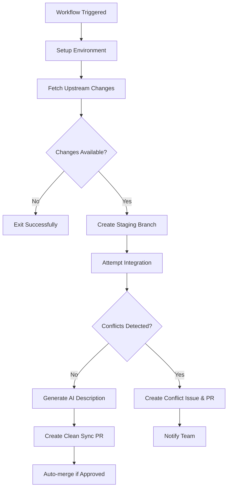

# Upstream Synchronization Workflow Specification

This document specifies the upstream synchronization workflow (`sync.yml`) that automatically keeps fork repositories synchronized with their upstream sources while managing conflicts safely.

## Overview

The sync workflow automates the integration of upstream changes into fork repositories using the three-branch strategy defined in [ADR-001](adr/001-three-branch-strategy.md). It provides scheduled synchronization with intelligent conflict detection and AI-enhanced PR descriptions.

## Architecture Decision

**Reference**: [ADR-001: Three-Branch Fork Management Strategy](adr/001-three-branch-strategy.md)

**Key Benefits**:
- **Automated Sync**: Daily upstream integration without manual intervention
- **Conflict Safety**: Conflicts isolated in dedicated integration branch
- **AI Enhancement**: Optional LLM-generated PR descriptions for better context
- **Scalable Process**: Handles repositories of varying sizes and complexity

## Workflow Configuration

### Triggers
```yaml
on:
  schedule:
    - cron: '0 0 * * *'  # Daily at midnight UTC
  workflow_dispatch:     # Manual trigger capability
```

### Permissions
```yaml
permissions:
  contents: write
  pull-requests: write
  issues: write
```

### Environment Variables
```yaml
env:
  UPSTREAM_REPO_URL: ${{ secrets.UPSTREAM_REPO_URL }}  # Set during initialization
  DIFF_SIZE_LIMIT: 20000  # Lines threshold for AI-enhanced descriptions
```

## Workflow Process

### High-Level Flow


### Phase 1: Environment Setup

**Security Tools Installation**:
```bash
# Install Trivy for vulnerability scanning
curl -sfL https://raw.githubusercontent.com/aquasecurity/trivy/main/contrib/install.sh | sh -s -- -b /usr/local/bin v0.49.1

# Install Claude Code for AI-enhanced analysis
npm install -g @anthropic-ai/claude-code

# Configure MCP (Model Context Protocol) for Maven projects
cat > .mcp.json << 'EOF'
{
  "mcpServers": {
    "mvn-mcp-server": {
      "type": "stdio",
      "command": "uvx",
      "args": ["--from", "git+https://github.com/danielscholl-osdu/mvn-mcp-server@main", "mvn-mcp-server"],
      "env": {}
    }
  }
}
EOF

# Install pr-generator-agent for AI-enhanced PR descriptions
pip install pr-generator-agent
```

**Repository Configuration**:
```bash
# Configure Git identity
git config user.name "github-actions[bot]"
git config user.email "github-actions[bot]@users.noreply.github.com"

# Add upstream remote if not present
git remote add upstream $UPSTREAM_REPO_URL || git remote set-url upstream $UPSTREAM_REPO_URL

# Fetch all branches and tags
git fetch upstream --prune --tags
git fetch origin --prune
```

**Branch Validation**:
- Verify `fork_upstream` branch exists
- Ensure `fork_integration` branch is available
- Validate upstream remote connectivity

### Phase 2: Change Detection

**Upstream Analysis**:
```bash
# Update fork_upstream to match upstream exactly
git checkout fork_upstream
git reset --hard upstream/main
git push origin fork_upstream --force

# Check for changes since last sync
CHANGES=$(git rev-list --count fork_upstream...origin/main)
if [ "$CHANGES" = "0" ]; then
  echo "No upstream changes detected"
  exit 0
fi
```

**Change Metrics**:
- Commit count since last sync
- File modification statistics
- Line addition/deletion counts
- Conflict probability assessment

### Phase 3: Staging Branch Creation

**Branch Naming**: `sync/upstream-YYYYMMDD-HHMMSS`

**Creation Process**:
```bash
# Create dated staging branch from current main
git checkout main
git pull origin main
BRANCH_NAME="sync/upstream-$(date +%Y%m%d-%H%M%S)"
git checkout -b "$BRANCH_NAME"

# Attempt to merge upstream changes
git merge fork_upstream --no-edit
```

### Phase 4: Conflict Detection and Handling

**Conflict Detection Logic**:
```bash
# Check for merge conflicts
if git diff --check; then
  CONFLICTS_FOUND=false
else
  CONFLICTS_FOUND=true
  # Extract conflicted files
  git diff --name-only --diff-filter=U > conflicted_files.txt
fi
```

#### Clean Merge Path

**AI-Enhanced PR Description**:
```bash
# Calculate diff size to avoid generating prompts that exceed model limits
MAX_DIFF_LINES=20000
DIFF_LINES=$(git diff fork_upstream | wc -l | tr -d ' ')

if [[ "$USE_LLM" == "true" && "$DIFF_LINES" -le "$MAX_DIFF_LINES" ]]; then
  # Use aipr tool with vulnerability analysis
  PR_DESCRIPTION=$(aipr -t fork_upstream --vulns -p meta -m $LLM_MODEL --max-diff-lines $MAX_DIFF_LINES 2>/dev/null || echo "")
fi
```

**PR Creation**:
```yaml
gh pr create \
  --title "⬆️ Sync with upstream $UPSTREAM_VERSION" \
  --body "$PR_DESCRIPTION" \
  --base fork_upstream \
  --head "$BRANCH_NAME" \
  --label "upstream-sync"
```

#### Conflict Resolution Path

**Conflict PR Creation**:
```yaml
# Create PR with conflict markers
gh pr create \
  --title "🚨 CONFLICTS: upstream sync $(date +%Y-%m-%d)" \
  --body-file conflict_pr_template.md \
  --base fork_integration \
  --head "$BRANCH_NAME" \
  --label "conflict" \
  --label "upstream-sync"
```

**Issue Creation for Manual Resolution**:
```yaml
gh issue create \
  --title "🔧 Manual Conflict Resolution Required" \
  --body-file conflict_issue_template.md \
  --label "conflict" \
  --label "manual-action-required"
```

### Phase 5: AI-Enhanced Descriptions

**Supported Providers**:
- **Claude (Anthropic)**: Primary choice (`claude-4` model)
- **Azure OpenAI**: Secondary option (`azure/gpt-4o` model)  
- **OpenAI GPT-4**: Tertiary option (`gpt-4.1` model)

**Prompt Template**:
```
Analyze the following upstream changes and generate a concise pull request description:

## Context
This is an automated sync from upstream repository. The changes include:
- {{ commit_count }} commits
- {{ files_changed }} files modified
- {{ lines_added }}+ / {{ lines_removed }}- lines

## Diff Content
{{ diff_content }}

Please provide:
1. A summary of key changes
2. Any breaking changes or migrations needed  
3. Notable new features or bug fixes
4. Potential impact on local modifications
```

**Content Limits**:
- **Diff Size Limit**: 20,000 lines maximum
- **Token Management**: Automatic truncation if needed
- **Fallback**: Standard template if AI unavailable

### Phase 6: Automatic Integration

**Auto-merge Conditions**:
```yaml
# Auto-merge criteria for clean syncs
if [[ "$CONFLICTS_FOUND" == "false" ]] && 
   [[ "$DIFF_LINES" -lt "1000" ]] && 
   [[ "$BREAKING_CHANGES" == "false" ]]; then
  
  # Enable auto-merge with required checks
  gh pr merge --auto --squash
fi
```

**Review Requirements**:
- No merge conflicts detected
- All status checks passing
- Diff size under auto-merge threshold
- No breaking changes identified

## Error Handling and Recovery

### Network Failures
```yaml
# Retry logic for network operations
for attempt in {1..3}; do
  if git fetch upstream; then
    break
  elif [ $attempt -eq 3 ]; then
    echo "Failed to fetch upstream after 3 attempts"
    exit 1
  else
    sleep $((attempt * 30))
  fi
done
```

### Authentication Issues
- **PAT Token Validation**: Check token permissions before operations
- **Remote Access**: Verify upstream repository accessibility
- **Rate Limiting**: Respect GitHub API rate limits with backoff

### Conflict Resolution Guidance

**Documentation Templates**:
- **conflict_pr_template.md**: Step-by-step conflict resolution guide
- **conflict_issue_template.md**: Detailed instructions and best practices

**Resolution Process**:
1. Checkout conflict branch locally
2. Resolve conflicts using preferred merge tool
3. Test changes thoroughly
4. Commit resolved changes
5. Push to branch and request review

## Performance Optimization

### Caching Strategy
```yaml
# Cache upstream repository data
- name: Cache upstream repo
  uses: actions/cache@v4
  with:
    path: ~/.cache/upstream-repo
    key: upstream-${{ github.repository }}-${{ hashFiles('.github/workflows/sync.yml') }}
```

### Resource Management
- **Execution Time**: Target < 5 minutes for typical syncs
- **Memory Usage**: Efficient diff processing for large repositories
- **Network Bandwidth**: Incremental fetches to minimize data transfer

### Monitoring Metrics
- **Sync Success Rate**: Track successful vs. failed synchronizations
- **Conflict Frequency**: Monitor conflict resolution patterns
- **Performance Trends**: Execution time and resource usage over time

## Integration with Other Workflows

### Validation Workflow
- Sync PRs trigger validation checks
- Build verification for Java projects
- Commit message format validation

### Release Workflow
- Upstream syncs can trigger new releases
- Version correlation with upstream tags
- Changelog generation includes upstream changes

### Build Workflow
- Automatic builds for sync branches
- Coverage reporting for upstream changes
- Integration test execution

## Configuration Options

### Environment Variables
```yaml
# Required
UPSTREAM_REPO_URL: Set during initialization

# Optional AI Enhancement  
ANTHROPIC_API_KEY: For Claude-powered descriptions
AZURE_API_KEY: For Azure OpenAI powered descriptions (with AZURE_API_BASE, AZURE_API_VERSION)
OPENAI_API_KEY: For OpenAI GPT-4 powered descriptions

# Behavior Customization
SYNC_SCHEDULE: Default "0 0 * * *" (daily)
DIFF_SIZE_LIMIT: Default 20000 lines
AUTO_MERGE_THRESHOLD: Default 1000 lines
```

### Workflow Customization
```yaml
# Custom sync schedule
- cron: '0 2 * * 1'  # Monday 2 AM (change from default daily)

# Custom diff limits
env:
  DIFF_SIZE_LIMIT: 50000  # Larger repositories
  
# Disable auto-merge
env:
  AUTO_MERGE_ENABLED: false
```

## Testing Strategy

### Unit Testing
- Conflict detection logic
- AI prompt generation
- Error handling scenarios

### Integration Testing  
- End-to-end sync with test repositories
- Multi-provider upstream testing
- Large diff handling verification

### Performance Testing
- Sync execution time benchmarks
- Memory usage profiling
- Network efficiency analysis

## Maintenance and Evolution

### Monitoring Requirements
- **Sync Health Dashboard**: Success rates and timing metrics
- **Conflict Analysis**: Pattern identification and resolution tracking
- **AI Enhancement Quality**: Description accuracy and usefulness

### Future Enhancements
- **Selective Sync**: Choose specific upstream paths
- **Smart Scheduling**: Dynamic sync frequency based on upstream activity
- **Advanced Conflict Resolution**: AI-assisted conflict resolution suggestions
- **Multi-Upstream Support**: Sync from multiple upstream sources

## References

- [ADR-001: Three-Branch Fork Management Strategy](adr/001-three-branch-strategy.md)
- [ADR-005: Automated Conflict Management Strategy](adr/005-conflict-management.md)
- [Product Architecture: Synchronization](product-architecture.md#43-synchronization-architecture-syncyml)
- [Initialization Workflow Specification](init-workflow.md)
- [Validation Workflow Specification](validate-workflow.md)